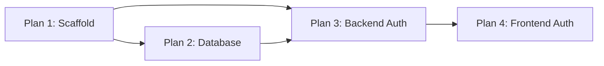

# Phase 1: Foundation — Plan Index

**Phase goal:** Stand up the project skeleton, database, and secure JWT authentication that all later features build on.

**Requirements covered:** F01 (registration & login), NF02 (JWT security)

## Plans

| # | Plan | Depends on | Parallelizable |
|---|------|-----------|----------------|
| 1 | [Project Scaffold & Docker](01-PLAN-1-scaffold.md) | — | No (foundation) |
| 2 | [Database Schema & Migrations](01-PLAN-2-database.md) | Plan 1 | Yes (with Plan 3 partially) |
| 3 | [Backend Authentication](01-PLAN-3-auth-backend.md) | Plans 1, 2 | No |
| 4 | [Frontend Auth & Protected Routes](01-PLAN-4-auth-frontend.md) | Plans 1, 3 | No |

## Execution Order

Recommended sequence: **1 → 2 → 3 → 4**. Plan 2 (database) can begin once Plan 1's backend scaffold exists; Plan 3 requires both the scaffold and the User model.

## Phase Definition of Done

- [ ] A user can register and log in receiving a valid JWT (F01)
- [ ] Protected routes reject requests without a valid token (NF02)
- [ ] Roles distinguish students from librarians
- [ ] `docker compose up` brings the full stack online

## Key Decisions (from CONTEXT.md)

- Access + refresh token scheme; access in memory, refresh in httpOnly cookie
- Students self-register; librarians seeded/admin-created
- Monorepo (`backend/` + `frontend/`), 3 Docker services
- Layered FastAPI backend (routers/models/schemas/services/core)
